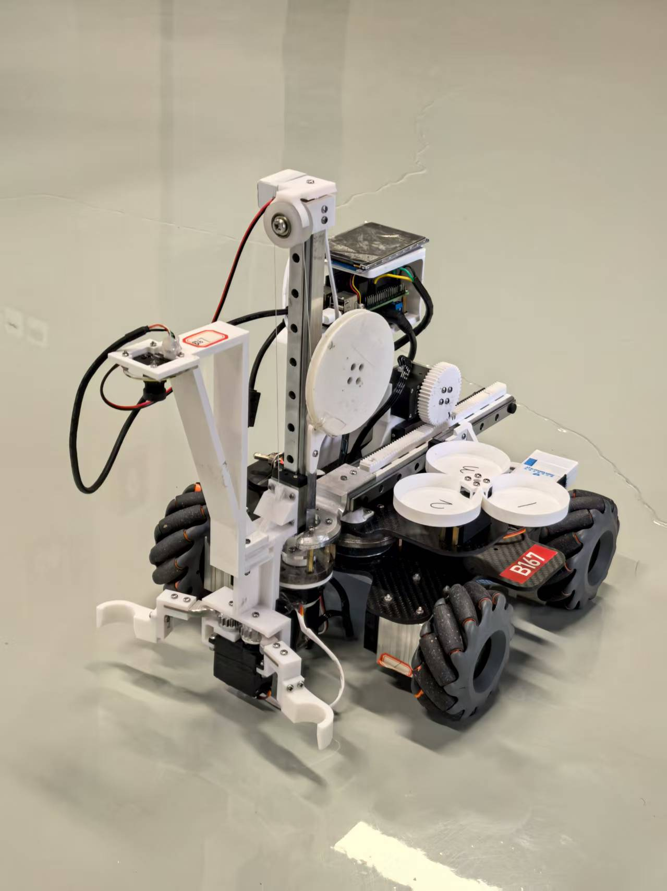
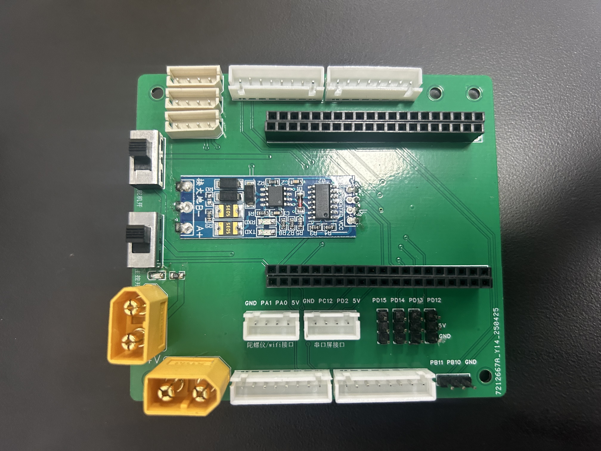
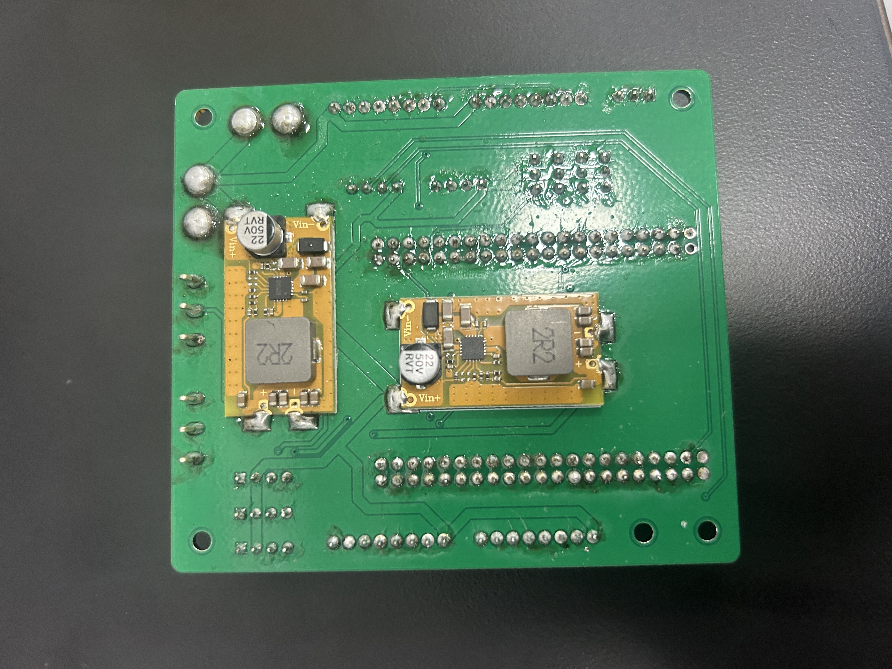
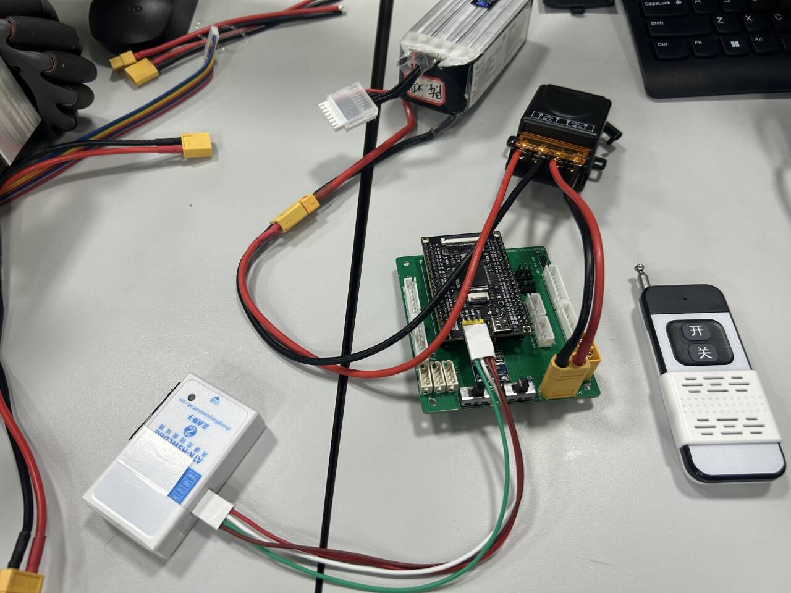

## 前言

欢迎参加物流搬运赛项，这是一个仅广东省赛就有一百多支队伍参加的赛项，而且由于题目变化不大，内卷极其严重。正如学长所说，一个学校最多只有两支队伍能进国赛，而且省赛晋级比例也就不足10%。

同时，这个比赛想进国赛拿国一可不是那么容易的，如果你还有实验室项目或者参加战队或者大三可能要考研的话还是建议认真考虑，毕竟按照25年工创赛国赛的情况，备赛周期从2024.9一直到了2025.8（虽然这是因为最终国赛延期举办了以及我们水平不够）

如果认真准备的话，这个比赛收获还是很大的。以我自己为例，参加比赛前没有任何机器人社团和战队经验（大一参加南工骁鹰招新结果被淘汰），就是打了个蓝桥杯嵌入式组比赛，学了点STM32的基础外设就来打比赛了。然后就是漫长的备赛周期（具体可以见我README里最后的比赛进度情况），经历了搭车装车、各种外设的控制实现、机械结构的讨论和修改、视觉的不断优化和反复的调参与测试、针对决赛内容的提前准备和预测等各种阶段。这一路走来也熟悉了很多东西，从基本的IIC读取传感器数据到串口DMA空闲中断进行数据接收，还有git使用、函数设计、工程结构管理等等。认真备赛的话对于自己的编程能力、**沟通能力**和时间管理能力都有不小的益处。**进国赛了还能拿保研加分，我们这一届进国赛后50%国二，30%国一，20%国特，而且不降等加分。** 我们这个车也是有历史传承的，算是三代国赛车了（我们国特，前面两届是金银奖）

所以如果自己有时间的话，无论基础如何，都不妨参与试试，说不定就拿国奖了呢

github仓库地址：（目前已闭源）
https://github.com/CycleYerik/Smart_Logistics_Handling_Robot
作者：CY （联系qq：908431711）

## 备赛过程经验分享

以我们组为例，主要分为几个阶段：

### 1.方案选型和验证
**这个阶段就是进行方案的讨论选型。其实是最关键的阶段**，因为后续的所有功能的实现难度和执行效率都取决于车的机械和硬件结构设计。比如另外一组的车是多轴机械臂，就可以实现抓取转盘任意位置的物料，而我们的夹爪臂结构只能抓取转盘上最靠近车身位置的物料，所以导致一旦任务顺序与转盘顺序不一致，需要在转盘进行非常久的等待（后期比赛时间限时三分钟，而我们车两轮下来光是转盘都可能需要花费一分半的时间，造成我们在运行时间上的劣势）所以在选型阶段**务必谨慎考虑**，具体的选型可参照学长的经验分享。我们车采用的就是学长所说的r-theta-z机械臂，坏处上面提到了，好处就是控制确实简单很多，精度上限也很高。还可以考虑龙门架配合可以伸缩的机械臂，我们在国赛看到很多，效果也很好。

具体的器件选型分析如下。

##### 电机方面
- 我们采用的张大头y42步进电机，基本上满足精度和稳定性的需求，而且控制起来非常简单（串口发送指令，自带位置模式和速度模式），所以底盘的移动如果用位置模式控制会**非常简单**
- 学长们采用的电机就需要对结合编码器或者ops来实现底盘的位置控制。我的建议是如果后续的任务对底盘定位精度要求没那么高，且小车放置物料靠机械臂精度而不是底盘精度，那步进电机完全够用。如果想做更为复杂和高精度的控制，则这个步进电机的控制频率可能就不一定够了，这个见仁见智吧
- 别的学校还有做舵轮、全向轮的

##### 舵机方面
- 我们机械臂核心的四个舵机都是飞特总线舵机（SM45BL），这个舵机的好处就是精度非常高，且也支持带加速度的控制，力矩也大，**效果非常好**（除了贵没啥缺点）
- 夹爪部分和载物盘采用的是普通的数字舵机（MG996R），效果也完全够用。但我感觉如果可以的话，可以试试用飞特舵机作为夹爪舵机，虽然会带来堵转烧舵机的风险，但夹物料绝对力大（很多车决赛寄掉就是因为夹爪夹取力度不够导致物料滑脱）

##### 上位机方面
- 我们用的树莓派5配合usb免驱摄像头，整体的算力和帧数也很够用，而且树莓派调试确实方便（直接vnc或者ssh）
- 然后也有组用的openmv作为上位机来进行视觉识别的，也可以用
- 还有学长用的jetson，似乎算力更高
- 树莓派记得配置摄像头端口绑定、vnc、ssh、开机自启动

##### 主控方面
- 我们用的stm32f407，性能和外设都够用（串口可能稍微少一点，就五个，节省着用）（注意，我们用过很多魔女开发板stm32，经常出问题，怀疑是设计问题，建议**谨慎使用魔女开发板**）
- 我看还有用大疆A板还是C板的，也可以（就是贵）

##### 供电方面
- 我们用的24V 6S 航模电池，12V的似乎也能用，**但24V还是更好**
  

##### 其它模块方面
- 我们用的维特的hwt101陀螺仪，效果确实好，基本没有零漂。mpu6050效果感觉不行
- 二维码识别的话其实有扫码模块，效果未知
- 还有补光灯模块，需要供电，最好能调整亮度和色温，对提升视觉鲁棒性有用
- **树莓派供电需要注意**，传统的降压模块没有pd协议，会触发树莓派供电不足的警告，且一定要保证模块是5V5A的输出。后续我们买了亚博智能的树莓派稳压电源，解决了这个问题（真的很好用）
- 烧录器建议用正点原子的无线高速烧录器，虽然贵，但是效果确实好，支持无线烧录和调试，比自己用有线烧录器效率提升太多太多
- 继电器选个电流大一点的，因为整车的电流其实不小
- 还有wifi串口模块和蓝牙串口模块，调试时用也挺不错的
- **整车的接线尽量完全避免杜邦线！！！** 要么就是各种xh线或者粗的电源线，要么就是用乔兰多线进行舵机线的延长。杜邦线实在太容易出问题了，一根线中间断了根本查不出来
- **显示屏推荐采用串口屏**，显示逻辑简单，效果好，还支持触屏控制交互

### 2.机械结构和硬件设计
在完成方案选型后，就是进行机械结构的搭建。
- 整体的结构设计可以去b站上找找，有很多车都开源了，也可以找学长学姐要祖传零件图
- 建议最开始用亚克力或者木板作为车的底板，在完成了大部分方案和功能的验证并确定不改结构后，再联系胡总或者战队看看能不能切玻纤板或者碳板（实测下来碳板确实会稍微强度高一点，但玻纤板其实也完全可以满足最终比赛要求）
- 然后其它的一些结构有能买的就买，比如滑轨、轴承、联轴器，不能买的就自己画图然后3D打印
- 后续针对部分关键的结构还可以考虑发金属加工件（不过加工件真的很贵，务必要保证这个加工件确实对提升精度或者稳定性有很好的效果不然真的用普通的PLA或者尼龙3D打印就行了）
- 然后一些易损部件要考虑好安装和替换的便捷程度，这样一旦损坏可以方便地替换，而不是拆车拆几个小时还换不上去
- 电池可以设计电池盒，但总归是要可拆卸，我们是直接用卡扣和底板连接，安装和取下非常方便
- **整体走线要合理设计**，不然机械臂运动就会被线卡住，造成堵转、松脱等问题。可以考虑用各种理线器来处理

然后机械结构还有一些要注意的点，主要是针对决赛的。
- 因为决赛会要求换物料和换爪子，而且物料底径有可能扩大，所以在设计载物盘的时候需要考虑扩大物料的放置。
- 同理，在设计爪子的时候也要考虑好尺寸。我们车就是整车尺寸太极限，爪子稍微画长一点就会超出尺寸限制。

然后还有硬件部分
- 这里主要是要有能力设计一块STM32拓展板，最好能集成降压模块、通讯模块、电机接口、舵机接口，然后推荐在总电源接口处加上一个**遥控继电器**（选工作电流大一点的），这样就可以用遥控开关直接给电机和舵机下电，这样一旦程序执行出错可以迅速断电，避免车疯跑或者舵机堵转。
- 同时由于这个拓展板集成了降压模块，所以整车的几乎所有走线都可以接入进来，包括但不限于：xt60供电线、舵机线、步进电机线、传感器线、树莓派通信线，这样就可以节省出很多车上空间用来满足机械臂的转动需求。而且如果不集成降压模块，则车上可能给舵机需要一个降压模块，给stm32也需要一个降压模块，太多了。
- 还有比如用飞特舵机，则最好把ttl转485的模块也集成上去，这样就可以进一步减少接线
- 后期如果车上接线太多，一旦出现某根线断了或者送了排查起来将会**极其困难**，且也会带来更多的风险点（比如某些线容易松）
- 还有就是有空闲可以考虑加入指示灯和蜂鸣器，程序执行到什么位置就发光或者发声，这样便于了解程序运行的情况
- 硬件还要考虑**绝缘**，比如各种板子的背面贴好胶布或者打热熔胶，尤其小心24V短路（火花四溅的那种）

我们组的板子就是我画的，其实就是各种插件的布局连连看，然后用的贴片降压模块和贴片ttl转485模块(我硬件外行，轻喷)

### 3.电控和视觉功能单独测试

这里主要就是先实现各个单独模块的控制和单独功能的实现，包括但不限于：
- 单独控制数字舵机
- 单独控制飞特舵机
- 单独控制步进电机
- 实现陀螺仪等传感器信号的读取
- 实现stm32与树莓派通讯的收发
- 视觉识别二维码
- 视觉识别直线和圆
- 视觉识别颜色色块
- 视觉识别颜色色环及其中心

这一部分就是可以单独测试，最好针对每个单独的功能写好**合理的驱动程序**，这样后续在应用层可以直接调用基本的外设控制和视觉功能来实现任务功能。（电控就照着例程看看，视觉就看看祖传代码，差不多了）

### 4.整车联调

这就是进行功能的实现了，包括但不限于：
- 底盘的移动（这个最好进行封装，可以一个函数直接实现全向移动，给定位置和速度加速度。我还针对位置模式设计了延时的自动计算，可以根据目标移动距离自动计算delay的时间，实现动作的连贯衔接）
- 底盘的视觉反馈调整和定位：就是可以通过视觉对底盘姿态进行校正，主要是前后左右的距离偏差和车身yaw角的校正
- 转盘抓取物料：通过视觉识别判断转盘停止，根据任务判断当前物料是不是目标抓取物料，根据物料位置调整机械臂进行抓取（还可以考虑加入在转盘处针对车身底盘的定位）
- 在色环处放置物料：可以定好车身位置后一次性开环放置三个物料，或者车身定位后夹取物料进行视觉二次定位以实现更高精度（我们可以达到90%以上的一环率）

等这些功能都实现后，就进行全流程的调试了，也有一些要点：
- 写好单独功能的测试程序：可能调着调着就发现某个功能有问题，提前写好测试程序，就能快速切换进行测试（尤其是在比赛调试的时候，可以快速发现问题）
- 进行模块化的函数设计：比如一些函数和流程可以复用，那就进行一些函数设计，全部用结构体进行参数传递，这样方便修改参数类型和数目。这个**非常重要**，因为后续会有很多功能需要实现，如果函数设计不合理，就会出现大量的屎山代码，读起来费劲改起来也费劲（真要是出现了这个情况，有时间的话就下决心重构吧）
- **做好参数管理**：尽量让各种需要调的参都汇聚在一起，这样随时就能修改，而不是在比赛现场找来找去找不到参数在哪个文件修改。同时还可以引入一些标志位参数，比如全流程运行或者单独测试的标志位，这样改一个数字就能实现功能的切换，不用注释代码
- 多调多想：很多问题可能需要大量的重复测试才会出现，尤其是通讯的问题，所以调车不要急，一调一晚上很常见
- **重视通讯和数据收发问题**：尤其是stm32和树莓派等上位机的通信，一些数据或者标志位需要通过串口传递，所以要规定好通讯的格式，加入诸如校验位和帧头帧尾的处理。推荐采用串口DMA配合空闲中断配合双缓冲区

总之多调多改多看，遇到问题解决问题，没有问题就继续调，调着调着就有问题了

### 5.夹爪及物料设计练习和测试

**这个其实非常重要**，根据我们省赛和国赛的经验，很多队伍决赛失利就是这个方面功夫没下足

我们的经验是：
- 设计合理可拆卸的夹爪和夹爪连接件：不需要每次都打一整个夹爪，完全可以把接触物料的部分和与夹爪臂连接的部分设计成分体结构，然后用螺丝连接。这样替换非常方便，打印速度还快
- 进行**大量的**夹爪设计和物料设计并测试：我们试过的就有三棱柱、四棱柱、五棱柱、六棱柱、三棱台、六棱台、螺旋三棱台、圆台、凸圆台、凹圆台、圆锥、圆柱、圆柱棱柱组合体、不对称物料等，而且发现一些物料似乎根本夹不起来，比如坡度过小的锥状物料。这个非常重要，因为你需要实际测试夹爪的夹取能力，才能知道针对不同形状和重量的物料，夹爪该如何设计。哪怕到了国赛，大部分队伍针对新物料设计的夹爪一样一个都夹不起来，而我们国赛都夹起来了，所以分数差距一下拉开了
- 具体的夹爪设计我也不是很懂，但大致的思路就是先在物料你想要抓取的位置取一圈外接圆，然后减小外接圆的直径（减小大概几个毫米），然后这个圆就是最终爪子和物料接触的圆了
- 夹爪设计还有些经验：首先考虑点接触，然后是线接触，尽量不要用面接触，不然爪子一变形，物料就掉了。用尖锐的顶点和物料接触摩擦力出奇的大
- 在完成夹爪设计后务必安装并完整跑完全流程，不然你无法验证爪子的抓取效果（自己用手掰和舵机上电转动的效果是完全不一样的）
- 针对新物料的抓取，由于肯定不好抓，所以机械臂的动作尽量**慢一点**，不能以初赛的速度来要求决赛，否则一个都抓不起来就老实了
- 如果用我们车的方案，**务必**写好测试物料参数的测试函数，比如单独抓取，单独放置，这样可以在比赛现场拿到新物料快速测试能不能抓取、该抓取什么位置

### 6.决赛功能测试
这个也很重要，因为决赛大概率就几个小时，顶天了一个通宵，而根据我们的经验，在没有车的情况下（车要上交保存），想盲写代码到能用基本不可能。所以需要**提前写好**可能要用到的功能比如：
- 针对地上随机顺序摆放的三个物料，识别三个物料各是什么颜色并抓取
- 将物料放置在旋转的转盘上对应的色环内（还要放准）
- 转盘上贴着三个条形码，先识别条形码内容，再将对应物料放置在条形码区域内
- 将物料在转盘上进行码垛（需要判断转盘上位置有没有物料）

### 7.比赛方案准备

主要是备用件、程序备份、决赛框架和功能、运输等

- 备用件：很重要，因为板子会烧，树莓派会烧，sd卡会坏，电机会烧，舵机会烧，3D打印件会断，线会送，电脑会死机，vnc会连不上，烧录器会坏。所以各种器件的备用件，甚至树莓派都要新拿一块配置好一个同样的环境备用着。还有就是vnc可能连不上，得带一块显示屏和鼠标，如果vnc连不上，还可以通过屏幕和鼠标来开程序，不然连程序都开不了
- 程序备份和代码版本管理：很重要，推荐直接git管理，做好分支管理和提交维护，这样不至于改完之后回退不了。还有就是尽量程序有备份，因为可能你的电脑在比赛现场就自动开始windows更新（我们省赛决赛出现过），如果此时你不能马上拿其它组员的电脑进行程序烧录，你就完蛋了。
- 决赛程序准备：就是之前说的，能进行快速切换，这样可以充分利用创新实践环节的调试时间（可能就十五分钟）
- 运输提前规划并做好安全措施：推荐用航空箱，塞上各种海绵泡沫等，最好一起上飞机托运，快递容易被暴力对待

### 8.调试和编程经验

主要是在日常的调车过程中的一些收获：
- 善用AI：**非常非常非常非常重要！！！！！** 现在AI读代码和写代码的能力超出我的想象，一个工程丢给cursor，马上能给你解释各个功能的实现原理，还能直接帮你改代码和写代码（虽然写出来的还是需要人工检查和修正），开发效率提升一百倍不是开玩笑的。我们用cursor改代码和分析代码，用gemini给思路，效果非常好
- 善于请教和学习：b站有很多开源的车，网上也很多类似的讨论群，咱们学校战队也有很多牛人，其它组也有很多大佬。无论是硬件软件还是团队管理问题，都可以去问
- 合理规划时间：虽然调车是永远调不完的，但也要注意学习情况，调车会上瘾（）

## 题目分析
比赛的决定性因素：
- 底盘位置移动的控制：主要是精度，无论是开环跑直线还是根据视觉进行微调，都对底盘的操纵性提出了很高的要求。其实核心的要求就是移动的稳定性，但目前看到的各种方案（陀螺仪配合编码器、陀螺仪配合ops等）都无法实现无需任何视觉校正的定位，所以总归是需要视觉进行位置姿态校正的，那其实底盘移动的精度不需要那么高，只要保证移动的稳定性即可（比如我们试来试去最后还是采用的步进电机位置模式控制，没有进行闭环校正，在决赛修改路径时一样能大致走准再配合视觉定位完成路径规划的要求）有些车采用的底盘控制方案过于追求精度，导致对发车位置、发车姿态、乃至场地地面情况都有非常高的要求。同时有些队伍的底盘路径是手调出来的，并没有理论值，所以一旦移动路径任务改变，则可能路径都走错
- 视觉识别的准确度和速度：在比赛环境下，可能会有不同的光照条件甚至阴影，对于颜色识别的干扰可能很大。同时，识别的速度也要越快越好，减少时间（这一点尤为重要，无论省赛还是国赛初赛，都有很多队死在二维码识别、转盘识别上，究其原因大概率就是因为光线环境的变化、物料颜色色差的变化等造成视觉失灵）
- 放置物料和抓取物料的动作速度：尽量做到连续抓取和放置，减少时间，同时保证放置的精度（哪怕到了国赛初赛，也有很多队伍的车明显看出来动作执行顺序和速度没有优化，在抓取放置上花费了太多的时间，在3min的运行时间限制下导致总分较低。与此形成对照的就是我们国赛决赛时其实放置准确度也收到色差干扰而严重失误，一环率只有4/12，但我们运行速度快，放完了十二个环，有些队虽然个个放置的都是一环，但只能放置九个环甚至放不到九个，反而被淘汰）
- 夹爪的设计：一个好的夹爪在能保证稳定夹取的同时还能不让物料在夹爪臂移动的过程中产生晃动或者影响视觉的识别，最好还具有通用性，比如我们国赛决赛就需要用一个爪子抓取三个不同形状的物料，也有省赛题目出现过两轮分别抓取不同形状的物料）

初赛：
- 由于是给定题目的，所以核心就是在尽量保证放置精度的情况下提升速度，从而得到更多的分数（我们后续国赛为了能在三分钟内完赛，每个物料放置只给了1.5秒的调整定位时间，哪怕调不准也得放，这样才能完赛）
- 要考虑到光照条件、物料重量等环境因素，还要做好各种器件的备用件和预案（比如夹爪断了、主控板烧了、VNC连接不上等）（我们上场准备了一个小箱子，里面包含了胶布、502胶、螺丝刀、备用主控板、备用夹爪、备用烧录器等，还为了防止树莓派vnc无法连接，准备了显示屏、键盘、鼠标来对树莓派进行控制。还准备了一套完整的3D打印件备件，防止车在托运、比赛过程中器件损坏导致无法运行）

决赛：
- 决赛题目会有变化，所以需要提前准备好各种功能函数的实现，到时候直接调用然后写改逻辑即可（否则现场写功能，在没有车进行调试的情况下几乎是不可能完成的任务，无论省赛还是国赛，能成绩较好的都是提前写出了很多决赛功能的）（比如我们国赛决赛从地上抓取随机顺序摆放的物料的功能早就实现过了，将物料放置在旋转转盘上也写过，只是没有写过放置在条形码上的程序，所以我们国赛功能改改就直接上了）
- 机械部分负责人需要提前练习夹爪的绘制，在创新实践环节能快速画出一个好用的爪子。需要提前练习，设计不同形状的物料，还要考虑物料的重量（我们尝试过从30g到100g的各种重量的物料，有些物料，形状相同，重量一增加就极其难夹），还要考虑到物料的色差（比如国赛的蓝色和绿色物料都有色差，我们的视觉识别还没出问题，但有很多队的识别就一下死了）

## 问题和教训参考

#### 碎碎念
- 改程序尽量注释而不是直接删掉，防止改完后忘了原来代码怎么写的
- 调车经验之谈：上电前务必三思，防止烧器件、忘了调参、忘了关电源等等；不要与一个问题或者故障死磕太久，防止陷入死胡同；最好不要一个人调
- 工程代码的设计在最开始就要进行结构化，防止后期的屎山和混乱（否则各种常用的功能函数或者底层实现一旦混乱改起来非常痛苦且危险
- **做好代码版本管理**（最好针对不同的测试或者尝试安排不同的分支，这样避免某些功能最终弃用但因为不好全部删除而导致屎山留存在工程中）（还有就是在进行各种新功能加入或者大改时做好版本管理，一旦出现问题还可以回退，不至于进退两难）
- **初始的机械结构选型务必务必务必务必务必务必务必谨慎**，不然到了后期改选型实在困难和痛苦，能用机械结构解决的问题尽量就别通过软件程序解决，不然可能带来巨大的隐患（比如通过金属加工件、防滑螺丝等保证结构的稳定性）
- **不要有畏难情绪**：很多问题一出现可能看起来非常麻烦，但要下定决心解决，否则最后调来调去还是无法回避这个问题（比如前期在尝试陀螺仪配合编码器进行位置姿态解算时认为过于复杂，几次尝试效果都不好，最后认为放弃了，但实际上如果坚持开发下去这套硬件是可以实现不错的定位效果的）

#### 遇到的问题

##### 软件
- 别问为什么用keil和CubeMX而不用CubeIDE这种明显更现代的平台，问就是祖宗之法不可变
- 大量的粗心错误，包括但不限于：忘记修改或者注释代码；忘记将测试代码改回正式代码；函数调用错误（最后在国赛决赛出现了）；命名错误
- 混乱的程序，包括但不限于：大量的相近代码没有实现复用，部分流程过于复杂
- 随意的代码管理，包括但不限于：没有及时备份代码；没有使用git进行版本管理导致不记得自己改了什么；代码没有交叉检查和review
- 裸机的屎山：如果熟悉rtos可以用上试试，也许会好用呢

##### 硬件
- 硬件PCB设计的不合理：功率和非功率的5V没有分开导致烧板子；拨码开关无法耐受大电流导致的电火花和击穿。
- 接线的混乱：很多线缺少外部保护措施和固定装置，容易出现磨损、脱落
- 安全意识不强：缺少疯跑保护措施；缺少短路保护措施导致24V直接短路

##### 机械
- 画图和设计的方法不当：容易缺少实际的测量，有时数据不准
- 结构问题导致车身重心偏前或者四个轮子安装略微不平行

##### 团队和沟通
- 懂得都懂

##### 调试
- 有线调试器（stlink）实在不方便
- 出现过多次的忘记接线（舵机、串口、电源）和接错线

